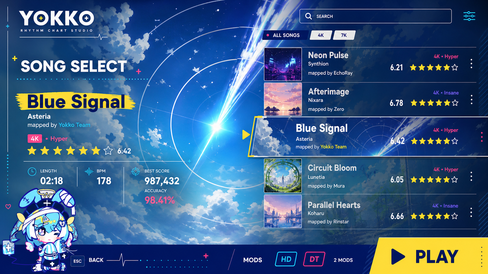

# Yokko 选歌页设计与开发交接

日期：2026-07-28  
目标仓库：`D:\yokko`  
目标平台：Yokko Desktop / osu!framework  
当前状态：视觉方向已确认，代码尚未开始实现。

## 1. 最终视觉真源

本轮最终选中的设计是 Blue Signal 版本：



已单独生成可直接接入游戏的 Blue Signal 谱面壁纸：


这两张图片已放进仓库，换电脑后只要同步仓库即可继续，不依赖原电脑上的 Codex 临时目录。

## 2. 最重要的产品原则

### 壁纸是谱面身份，不是专辑封面

选中谱面后，它的 16:9 壁纸必须铺满整个页面，成为第一视觉层。

- 不能只显示一个方形封面。
- 不能把壁纸全局重度模糊。
- 不能用大面积不透明面板遮住壁纸。
- 可以在文字和控制区下面做局部深色渐隐、局部透明遮罩或轻微局部模糊。
- 页面中间和主要焦点区域要保留足够的清晰壁纸。
- 右侧每个谱面条目也使用自己的横向壁纸裁切，而不是方形专辑图。

未来导入真实 `.osu` 谱面时，应该优先读取谱面自带背景；缺少背景时再使用 Yokko 默认壁纸。

### 保持 Yokko 主界面语言

不是复制 osu!lazer 的皮肤，只借鉴它成熟的选歌流程。

Yokko 的视觉真源：

- 象牙白：`#FDFDFB`
- 深海军蓝：`#09165E`
- 亮青色：`#4AD0F0`
- 浅青色：`#C7F5FF`
- 暖黄色：`#FFE86B`
- 热粉色：`#FF38A6`
- 粗体几何无衬线字体，继续沿用当前 `HomeTypography`
- 加号、心电线、刻度尺、点阵和套准十字作为装饰
- 吉祥物只做小面积陪伴，不遮挡谱面信息和壁纸主体

## 3. 页面目标

用户从主界面点击 `Play` 后进入选歌页，并能完成：

1. 浏览谱面。
2. 搜索和筛选 4K / 7K。
3. 查看当前谱面的标题、作者、谱师、难度、用户所选的 Etterna MSD 或 Rebirth 星级、时长、BPM 和本地最佳成绩。
4. 打开和切换 Mod。
5. 点击 `Play` 或按 Enter 开始游玩。
6. 按 Esc 返回主界面。

页面必须键盘和鼠标都能用。

## 4. 设计尺寸与布局

继续采用 Yokko 主界面的设计基准：

- 设计画布：`1280 x 720`
- 实际窗口：整体等比缩放，不能在小窗口中裁切
- 页面类型：全屏 `Screen`

建议布局：

### 顶部

- 左上：YOKKO logo
- 左侧主标题：`SONG SELECT`
- 右上：搜索框
- 搜索框下方：`ALL SONGS`、`4K`、`7K`
- 最右：筛选设置图标

### 左侧信息区

约占画面宽度的 42%。

- 当前歌曲大标题
- 艺术家
- `mapped by ...`
- 模式与难度名
- 用户设置选择的 Etterna MSD 或 Rebirth 星级
- 时长
- BPM
- 本地最佳成绩与准确率

文字下方只铺局部海军蓝透明渐隐，不能做完整不透明侧栏。

### 右侧谱面列表

约占画面宽度的 48%，靠右排列。

- 每条是宽幅壁纸条目，推荐比例约 `16:5`
- 当前条目更高、更亮，使用黄色强调边
- 普通条目保持透明，允许看到背景壁纸
- 显示标题、艺术家、模式、难度和用户选择的难度评级
- 鼠标悬停和键盘焦点必须可见
- 切换谱面时，全屏背景同步交叉淡入

### 底部操作栏

- 深海军蓝实色底
- 左侧：`ESC BACK`
- 中间：`MODS` 和 Mod 开关
- 右侧：大面积黄色 `PLAY`
- `PLAY` 是唯一主按钮，其他操作不能抢视觉权重

## 5. 交互规格

### 选歌

- 单击谱面条目：选中并更新背景及详情。
- 双击谱面条目：直接开始游玩。
- 上下方向键：切换当前谱面。
- Enter：开始当前谱面。
- Esc：返回主界面。
- 切换选中项后，背景在约 `180–240 ms` 内交叉淡入。
- 详情文字和选中条目的移动可以使用 `OutQuint`，保持与主界面一致。

### 搜索与筛选

- 搜索匹配标题、艺术家、谱师和难度名。
- `4K` 与 `7K` 是可切换筛选。
- 搜索或筛选后如果当前谱面不可见，自动选中第一条结果。
- 没有结果时保留页面框架，显示明确空状态，不能崩溃或退出。

### Mod

设计图中展示 `HD` 与 `DT`，但不能出现“UI 显示已启用、实际游玩完全无效果”的假行为。

推荐分阶段：

1. 先实现 Mod 抽屉和选中状态模型。
2. 只让真正有 Gameplay 支持的 Mod 进入可用状态。
3. 未实现的 Mod 使用禁用样式和说明，不显示为已激活。
4. Mod 选择通过小而明确的 launch options 传给 `GameplayScreen`。

不要为了这一个页面提前建设大型插件系统。

## 6. 建议代码结构

遵守当前模块边界，页面实现放在 `Yokko.Game`：

```text
Yokko.Game/
  Screens/
    SongSelect/
      SongSelectScreen.cs
      SongSelectEntry.cs
      SongSelectSongList.cs
      SongSelectSongRow.cs
      SongSelectDetails.cs
      SongSelectFilters.cs
      SongSelectModBar.cs
      SongSelectTheme.cs
```

这是建议拆分，不要求机械照搬。小组件可以先合并，职责开始膨胀后再拆。

### 建议模型

`SongSelectEntry` 保持简单，先用 `internal sealed record`：

```csharp
internal sealed record SongSelectEntry(
    YokkoBeatmap Beatmap,
    string WallpaperTexture,
    ManiaMsdResult DifficultyRating,
    TimeSpan Length,
    double Bpm,
    int BestScore,
    double BestAccuracy);
```

如果后续已有真实谱面库模型，应让 UI 映射真实模型，不要长期维护第二份谱面真源。

### 第一版数据

当前仓库还没有完整歌曲库页面，可以先提供 4K / 7K demo 条目来关闭交互闭环：

- Blue Signal
- Neon Pulse
- Afterimage
- Circuit Bloom
- Parallel Hearts

每条先映射到 `DemoBeatmaps.CreateFourKeyDemo()` 或 `CreateSevenKeyDemo()`，但标题、难度和壁纸应由条目模型提供。

后续接真实导入库时，替换 entry provider，不重写 UI。

## 7. 当前代码接入点

主界面的 Play 目前直接进入 Gameplay：

```csharp
new HomePrimaryAction(
    YokkoStrings.Get("main.play"),
    YokkoStrings.Get("main.song_select"),
    FontAwesome.Solid.Play,
    () => this.Push(new GameplayScreen(DemoBeatmaps.CreateFourKeyDemo())))
```

位置：

`Yokko.Game/Screens/Main/MainScreen.cs`

应改为：

```csharp
() => this.Push(new SongSelectScreen())
```

`SongSelectScreen` 中的 Play 再执行：

```csharp
this.Push(new GameplayScreen(selectedEntry.Beatmap, ...));
```

不要把选歌状态堆进 `MainScreen`，也不要把歌曲库逻辑塞进 `GameplayScreen`。

## 8. 资源接入

当前已生成的壁纸在：

```text
docs/design/song-select/blue-signal-wallpaper.png
```

实现时将运行时资产复制到：

```text
Yokko.Resources/Textures/SongSelect/blue-signal.png
```

`Yokko.Resources.csproj` 已嵌入 `Textures/**`，不需要新增额外资源规则。

还需要补齐以下独立壁纸：

- `neon-pulse.png`
- `afterimage.png`
- `circuit-bloom.png`
- `parallel-hearts.png`

每张图都应该：

- 使用 16:9 原图。
- 无文字、无 UI、无 logo、无水印。
- 能裁成 `16:5` 列表条目。
- 与 Blue Signal 保持同一套动画环境插画风格。

不要从概念图里直接裁图充当最终资产。

## 9. 视觉实现注意事项

- 背景用 `Sprite` + `FillMode.Fill`，切换时双层 Sprite 交叉淡入。
- 对背景做轻微整体深色 tint 可以，但不能破坏壁纸辨识度。
- 文字区域用透明 `Box` 或局部渐隐素材保护可读性。
- 不要全屏套高斯模糊。
- 不要到处使用圆角卡片。
- 谱面列表更接近连续列表，不是卡片网格。
- 当前条目的强调由尺寸、黄色边和亮度共同完成。
- 保留主界面的轻微入场动画、悬停和呼吸感，但不要让列表持续大幅运动。
- 吉祥物建议复用 `yokko.png` 的当前裁切逻辑，缩小放在左下。

## 10. 本地化

在 `Yokko.Game/Localisation/YokkoLocalisation.cs` 增加选歌页字符串。

至少包括：

- `song_select.title`
- `song_select.search`
- `song_select.all_songs`
- `song_select.mods`
- `song_select.play`
- `song_select.back`
- `song_select.no_results`
- `song_select.local_best`
- `song_select.mapped_by`

继续提供英文、中文和日文，不要把可见文案直接散落在 UI 类中。

## 11. 测试与验证

这是较大的 UI 改动，完成后必须验证，但不要一上来跑几个小时的无关全量测试。

### 必做 focused tests

新增：

```text
Yokko.Game.Tests/Visual/TestSceneSongSelectScreen.cs
```

至少覆盖这些可操作状态：

- 默认选中 Blue Signal。
- 切换到下一条谱面。
- 4K / 7K 筛选。
- 搜索有结果。
- 搜索无结果。
- 打开 Mod 区域并切换一个受支持 Mod。
- 点击 Play 推入 Gameplay。
- Esc 返回。

### 推荐验证命令

先执行：

```powershell
dotnet build .\Yokko.Desktop.slnf
```

再执行与 Song Select、MainScreen、Gameplay 导航直接相关的 focused tests。

如果改动触及跨模块公共 API、Gameplay Mod 行为或谱面库，再扩大测试范围。

### 视觉验收

在 `1280 x 720` 和一个较小窗口下分别确认：

- 壁纸完整且清晰。
- 右侧列表没有被裁切。
- 搜索框、筛选和 Play 可操作。
- 文字在亮色壁纸上仍可读。
- 吉祥物不遮挡主要信息。
- 切换背景没有闪白或黑帧。
- 页面缩放后仍然保持 16:9 设计比例。

## 12. 完成标准

第一版完成需要同时满足：

- 主界面 Play 进入 Song Select，而不是直接进入 demo Gameplay。
- 页面视觉接近最终概念图。
- Blue Signal 壁纸真正铺满背景。
- 至少五条 demo 谱面可选。
- 搜索和 4K / 7K 筛选可用。
- Play 能进入当前选择的 Gameplay。
- Esc 能返回。
- Mod 区有真实状态，不伪装未实现效果。
- 小窗口不裁切。
- 构建和 focused tests 通过。

## 13. 明确非目标

这轮先不要顺手做：

- 完整在线谱面商店。
- 排行榜后端。
- 云端收藏同步。
- 大型歌曲数据库重构。
- 完整 osu!lazer 克隆。
- 为尚未实现的 Mod 提前建立复杂插件系统。

先把“点击 Play → 选歌 → 筛选/Mod → 开始游玩”的本地核心闭环做漂亮、做可靠。
