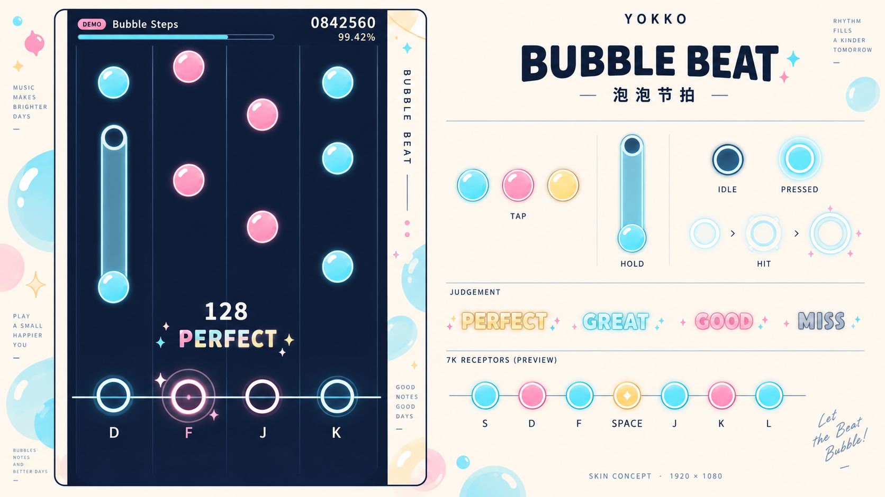

# YOKKO「泡泡节拍 / Bubble Beat」皮肤设计

状态：已被用户否决的早期视觉提案，保留供追溯，不作为实现目标。用户明确要求优先考虑 osu! 玩家的使用习惯。后续方向见 `yokko-circle-skin-v2.md`；下方原稿尚未接入游戏，也不是实机截图。

## 设计方向

围绕小球音符建立一整套下落式键盘音游皮肤，延续 Yokko 选曲界面的水蓝、奶白和樱粉色调。球体使用珍珠软糖质感：实心可读的中心、清晰外轮廓、一弯高光和一条短高光构成统一识别特征。轨道内克制，装饰留在轨道外。

共享界面基准为 1920×1080。概念展示板中的部件图例不属于正式游玩 HUD。

## 配套部件

| 部件 | 外观与状态 |
| --- | --- |
| 单点音符 | 正圆珍珠球，细奶白轮廓；颜色变化不改变直径和视觉重量 |
| 长按头 | 延续单点球体，用内侧细环辅助识别 |
| 长按身体 | 比球头窄的半透明软糖带，两侧有连续细线，不使用断开的泡泡串 |
| 长按尾 | 空心圆端点；与实心头部区分，释放时刻仍以原判定规则为准 |
| 接球器 | 空心圆环，圆心落在统一判定线上；未按下时降低亮度 |
| 按键按下 | 环体变亮，中央出现小光芯，松开后快速回落 |
| 单点命中 | 短促扩散双环及少量碎光，控制在当前轨道附近 |
| 长按维持 | 接球器持续柔亮，身体略提亮；不让整条轨道高频闪烁 |
| 判定文字 | 独立文字层；颜色之外保留明确文字，不将文字烘焙进特效 |
| 连击与精度 | 清晰几何字体；避开主要读谱区，不逐拍移动位置 |
| 危险物件 | 若谱面包含 Mine，沿用明确危险标识，不能做成易混淆的普通糖球 |

## 色彩和键位

| 用途 | 色值 |
| --- | --- |
| 轨道背景 | `#101C36` |
| 外轮廓、主要文字 | `#FFF8EE` |
| 水蓝音符 | `#67DBED` |
| 樱粉音符 | `#F49BBB` |
| 中心特殊列 | `#FFE092` |

- 4K：蓝、粉、粉、蓝；默认键位 D / F / J / K。
- 7K：蓝、粉、蓝、黄、蓝、粉、蓝；默认键位 S / D / F / Space / J / K / L。
- 7K 中心球增加一个小内菱形作为形状提示，不仅依靠黄色区分。
- 皮肤颜色与分数判定无关，不引入新音符规则。

## 尺寸与动效建议

以下为待实机验证的设计目标，不是已经实现或测试过的参数。

- 球体可见直径约为轨道宽度的 68–74%，各颜色保持一致。
- 长按身体宽度约为球体直径的 35–42%，头、身体和尾对齐同一中心轴。
- 球体使用不透明核心；透明效果主要用于长按身体和短暂特效。
- 特效最大直径约为球体的 1.4 倍，100–150 ms 内结束，不覆盖相邻轨道的音符。
- 按下反馈约 60–80 ms；纯装饰不影响输入反馈或音频时钟。
- 减弱动态模式移除扩散环和粒子，保留即时明暗反馈。
- 长按维持用稳定明暗表现，避免周期亮灭造成松开错觉。
- 判定线必须明确，球体中心与实际时序基准的对应关系需在接入时检查。

## 后续接入边界

现有 `DrawableNote` 已通过 `OsuManiaSkin` 读取单点与长按贴图，`LaneColumn` 已区分静止／按下接球器、长按光效和命中特效。这套设计可优先适配现有皮肤路径，避免修改 Core 计分或时序规则。

正式接入时将球、长按头／身体／尾、接球器和特效逐个制作成透明 PNG，放入 `Yokko.Resources`，由实际界面加载。长按身体需可纵向延展或平铺，避免拉伸球体。动态文字、判定线和规则分割线由代码承担。

不能将本次整张概念图作为游玩背景来代替部件实现。接入后需在相同 1920×1080 视口下检查 4K、7K、密集单点和长按交错的实机画面；本次只交付视觉设计，不启动构建或耗时测试。

## 生成记录

使用内置 ImageGen 生成原创视觉提案；完整提示词见 `bubble-beat-prompt.txt`。既有选曲稿仅用于人工观察项目配色和气质，本次生成未传入参考图片，也未复用第三方角色或品牌素材。
