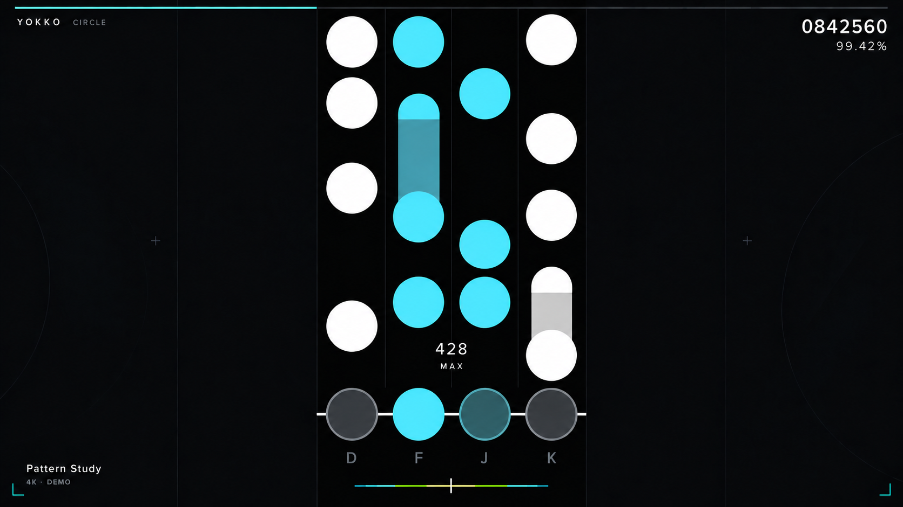

# YOKKO Circle：以 osu!mania 读谱习惯为先

状态：圆键方案持续修订，当前为第三版，尚未接入或经过玩家实测。用户指出第二版球体过小，本版同时放大音符和整组轨道，并保持适当列间空隙。使用内置 ImageGen 编辑，提示词见 `yokko-circle-v3-prompt.txt`，同列粘连修正见 `yokko-circle-v3-spacing-prompt.txt`。生成图表达外观方向，不作为精确坐标测量来源。

## 修正原因

第一版把球体做成软糖，把轨道做成装饰容器，又用发光接球器、星星和大判定字争夺注意力。画面只能说明美术主题，不能证明密集谱面易读。新方向首先保持熟悉的音符轮廓、列间关系、落点和读谱区域。

osu!mania 玩家并非共享一种皮肤偏好。圆键、条键、箭头的识别习惯，以及轨道宽度、左右位置、判定高度和滚速，都不应被品牌风格强行统一。这次首先设计用户提到的圆键版本；条键和箭头属于可另行制作的同系列外观，不声称已经完成。

## 默认圆键方案

| 项目 | 设计目标 |
| --- | --- |
| 视口 | 1920×1080，直接展示游玩画面，不用部件海报代替 |
| 轨道 | 纯黑、足够宽以容纳大圆键，相邻列保留清楚的小缝，弱化分隔线；允许玩家改宽度与位置 |
| 4K 配色 | 白／青／青／白，所有普通音符使用相同尺寸和形状 |
| 7K 配色目标 | 白／青／白／浅黄／白／青／白；中心仍保持相同圆形，不增加菱形内标 |
| 单点 | 扁平不透明圆片，边缘清楚，移除镜面高光、光晕和多层描边 |
| 长按 | 同色圆头，连续而更暗的直条身体，明确尾端；各段相连，不使用空心泡泡尾 |
| 接球器 | 固定同尺寸暗圆，按下仅提亮；不做扩散环或大范围闪光 |
| 判定 | 小而稳定，提供位置、透明度及隐藏选择；图中 MAX 仅为视觉文案示意，不改变计分档位 |
| 连击 | 固定位置与字号，避免缩放跳动；允许独立调整或隐藏 |
| 品牌 | 字体、小标识和轨道外少量青色细节，不改变读谱符号 |

## 参数不是强制标准

第三版的 1920×1080 设计目标为总轨道宽 480 px、单列宽／圆心间距 120 px、圆片与接球器直径 108 px、相邻同押圆片净距 12 px、判定线 y≈930。球径占单列宽度 90%，较上一版 66 px 的目标增大约 64%。整组轨道同时变宽，不能只增大圆片导致跨列粘连。

这些是设计目标，生成图中的实际像素可能存在偏差；不是所有玩家的强制设置，也不能直接当作 legacy skin.ini 坐标。接入时需要经过 Yokko 的坐标转换。纵向音符间距由真实谱面时间和滚速决定，不得为了配图好看改变谱面时序；图中的排列仅作尺寸示意。需用密集真实谱面验证大圆键是否遮挡，必要时由音符大小与滚速设置协调。

优先尊重玩家已有的皮肤和设置：列宽、音符大小、轨道横向位置、判定高度、滚动方向、滚速、判定字位置和连击位置。切换到 Yokko 自有外观时，不应无提示重置这些读谱参数。实现前需要核对现有设置的优先级和覆盖关系。

## 参考依据和实现边界

- [osu! 官方 skin.ini 文档](https://osu.ppy.sh/wiki/en/Skinning/skin.ini)：`ColumnWidth`、`HitPosition`、`WidthForNoteHeightScale`、`ScorePosition`、`ComboPosition` 等是可分别配置的参数。它支持保留个人读谱设置的设计方向，但不证明所有玩家偏爱本稿的默认值。
- [osu! 官方 mania 皮肤部件说明](https://osu.ppy.sh/wiki/en/Skinning/osu!mania)：单点、长按头／身体／尾和接球器分别定义。仅参考公开结构，不复制第三方皮肤素材。
- Yokko 当前的 `OsuManiaSkinConfiguration` 已表达上述多类参数，`DrawableNote` 与 `LaneColumn` 已有对应贴图路径。后续应沿用这些边界，不重写判定或音频时序。

正式素材接入时放入 `Yokko.Resources` 并实际加载。概念图不得作为整张游戏界面贴图使用。

## 验收重点

先用密集同押、楼梯、纵连、长按夹单键快速对照，而不是只看稀疏音符。核对音符与接球器大小一致、判定基准一致、长按连接连续，以及命中瞬间不遮挡下一颗音符。4K 和 7K 分别看实机；实际手感必须由可运行皮肤和玩家体验验证，不能从设计稿推断已经好用。

本轮仅更新设计稿和说明，没有进行构建或耗时测试。
